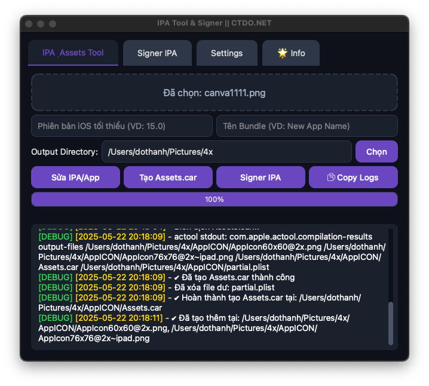

# IPA Tool & Signer

A modern macOS application for modifying and signing iOS IPA files, creating Assets.car from PNG images, and managing provisioning profiles. Built with PyQt6, it offers a sleek interface with Light/Dark mode support and a user-friendly drag-and-drop experience.

## Features
- **IPA/App Modification**:
  - Update Minimum iOS Version.
  - Change Bundle Name and Identifier.
  - Remove unwanted files/folders (e.g., SC_Info, PlugIns, .dylib) with customizable settings.
- **Assets.car Creation**:
  - Generate Assets.car and iOS-compliant icons from a single PNG image.
  - Supports multiple icon sizes for iPhone and iPad.
- **IPA Signing**:
  - Re-sign IPA files with custom certificates and provisioning profiles.
  - Update App ID, Display Name, Version, and Short Version.
  - Option for re-signing only without modifying other metadata.
- **User Interface**:
  - Drag-and-drop support for .ipa, .app, .png, and .mobileprovision files.
  - Light/Dark theme with smooth transitions.
  - Detailed logs with color-coded status (DEBUG, WARNING, ERROR).
  - Copy logs to clipboard for easy sharing.
- **Provisioning Profile Management**:
  - Automatically extract Application ID from .mobileprovision files.
  - Embed provisioning profiles during signing.
- **Settings**:
  - Customize file/folder deletion rules with recursive options.
  - Theme selection (Light/Dark) with instant preview.

## Screenshots
Explore the app's interface and features through the screenshots below:

| Main Interface | IPA Signing | Assets Creation | Settings | Info Tab |
|----------------|-------------|-----------------|----------|----------|
|  |  |  |  |  |

**Additional Screenshots**:

| *Light Theme* | 
|---------------|
|  |

| *Dark Theme*  | 
|---------------|
|  |

| *Log Output*  | 
|---------------|
|  |

## Installation
1. Download the `.dmg` file from the [Releases](https://github.com/thanhdo1110/IPA-Tool-Signer/releases/tag/IPA-Tool-Signer) page.
2. Open the `.dmg` file and drag `IPATool.app` to your Applications folder.
3. Launch `IPATool.app` from Applications.

## Usage
1. **Modify IPA/App**:
   - Drag an `.ipa` or `.app` file into the "IPA & Assets Tool" tab.
   - Specify Minimum iOS Version or Bundle Name (optional).
   - Choose an output directory and click "Sửa IPA/App".
2. **Create Assets.car**:
   - Drag a `.png` image into the "IPA & Assets Tool" tab.
   - Select an output directory and click "Tạo Assets.car".
3. **Sign IPA**:
   - Go to the "Signer IPA" tab.
   - Drag an `.ipa` file and a `.mobileprovision` file.
   - Select a signing certificate from the dropdown.
   - Optionally update App ID, Display Name, Version, or Short Version.
   - Check "Re-Sign Only" if no metadata changes are needed.
   - Choose an output path and click "Start Signing".
4. **Settings**:
   - Customize file deletion rules in the "Settings" tab.
   - Switch between Light and Dark themes (requires app restart).

## System Requirements
- **OS**: macOS 10.15 (Catalina) or later
- **Dependencies**:
  - Xcode Command Line Tools (for `xcrun` and `actool`).
  - Valid code-signing certificates in Keychain (for signing).
- **Disk Space**: ~100 MB

## Notes
- Ensure Xcode Command Line Tools are installed (`xcode-select --install`) for Assets.car creation.
- Signing requires a valid Apple Developer certificate and provisioning profile.
- Use this tool for educational or personal purposes only, in compliance with Apple’s policies.

## Credits
- **Developer**: Đỗ Thành
- **Website**: [ctdo.net](https://ctdo.net)
- **Contact**: [Telegram](https://t.me/dothanh1110) | [GitHub](https://github.com/thanhdo1110)

## License
© ctdoteam - All rights reserved. This tool is for educational and personal use only.
